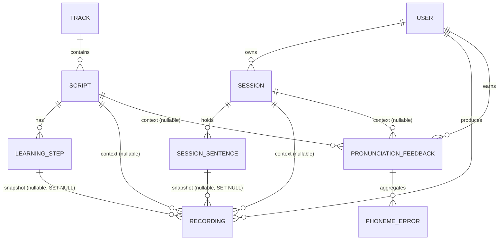

# IMPLEMENTATION PLAN

ECHO 백엔드(영어 발음 학습/평가 서비스)의 전체 구현 로드맵. 본 문서는 `docs/` 의 다섯 권위 문서를 한 줄로 꿰어 **어떤 순서로 무엇을 구현·검증해 PR로 끊어 갈지** 를 정의한다. 현재 코드베이스는 `EchoBackApplication.java` 한 파일뿐인 그린필드 상태다.

> 📌 **작성 원칙**
> - `/springboot-tdd` 강제: RED → GREEN → REFACTOR, JaCoCo 80%+, MockMvc + REST Docs, `@DataJpaTest`, AAA 패턴.
> - 모든 코드 변경은 본 계획서가 정의한 Phase 단위 PR로 분리한다.
> - 본 문서는 `docs/legacy/` 를 참조하지 않는다.

---

## 1. 개요 & 범위

### 1.1 목적

- 다섯 권위 문서(스펙·테스트 계획·엔티티·컴포넌트·모델 서버)의 결정을 **Phase 단위 작업 카드**로 변환해 누구든 다음 PR을 시작할 수 있게 한다.
- 잠긴 기본값(Locked Defaults)과 미결 결정(Open Questions)을 명시해 구현 도중 의사결정 비용을 줄인다.
- 각 Phase 의 진입 테스트가 `docs/API_TEST_PLAN.md` 의 어떤 테스트 ID 와 매핑되는지 1:1 추적한다.

### 1.2 권위 있는 입력 문서

| 문서 | 책임 |
|---|---|
| `docs/API_SPEC_REFINED.md` | REST 26개 엔드포인트, ApiResponse 봉투, ErrorCode 19종, JWT, CORS, 멀티파트 |
| `docs/API_TEST_PLAN.md` | 26 컨트롤러 테스트 + 15 서비스 도메인 불변식 테스트, 픽스처·Mock 전략 |
| `docs/ENTITIES_REFINED.md` | JPA 엔티티 10종, 인덱스, CHECK 제약, 정적 팩터리 불변식 |
| `docs/COMPONENTS_REFINED.md` | 패키지 레이아웃, 외부 어댑터, 서비스 흐름 |
| `docs/MODEL_SERVER_API_SPEC.md` | `/analyze`, `/g2p` 컨트랙트 |
| `CLAUDE.md` | 도메인 5분할, 빌드/테스트 커맨드, 스택 제약, 글로벌 패키지 규약 |

### 1.3 다루지 않는 것

- 프론트엔드(앱/웹)
- 운영 인프라(쿠버네티스, CI/CD 파이프라인 정의, Terraform 등)
- 모델 서버/TTS 서버 자체의 구현
- `docs/legacy/` 의 구 문서

### 1.4 도메인 5분할 ↔ 컨트롤러 매핑

| 도메인 | 컨트롤러 | 엔드포인트 수 |
|---|---|---|
| Member | `AuthController`, `MemberController` | 7 |
| Learning | `TrackController`, `ScriptController`, `SessionController` | 9 |
| PronunciationEvaluation | `RecordingController`, `FeedbackController`, `FeedbackQueryController`, `TtsController` | 7 |
| Statistics | `StatsController`, `RankingController` | 2 |
| System | `HealthController` | 1 |
| **합계** | | **26** |

---

## 2. 기술 스택 & 글로벌 결정

### 2.1 스택 (CLAUDE.md 정합)

- Spring Boot **4.0.5**, Java **25** (Gradle toolchain auto-provision)
- Spring Web MVC (servlet) / Spring Data JPA / Spring Security + OAuth2 client
- MySQL 8 (운영) + H2 in-memory MySQL 모드 (테스트)
- Spring REST Docs (MockMvc), Asciidoctor 통합
- Lombok, Spring Boot DevTools, Bean Validation
- Spring Boot Actuator (보안 분리)

### 2.2 글로벌 결정

| 결정 | 값 |
|---|---|
| 패키지 루트 | `com.capstoneecho.echo_back` |
| 글로벌 코드 위치 | `com.capstoneecho.echo_back.global.*` (CLAUDE.md 규약) |
| 응답 봉투 | `ApiResponse<T>` 단일화, `@JsonInclude(NON_NULL)` |
| 봉투 예외 | `POST /api/tts` — 200 응답 시 raw MP3 bytes |
| 시간 직렬화 | ISO-8601 UTC `Instant` |
| KST/zone 변환 | `StatsService.attendance` (출석 일자 버킷팅) + `MemberService.awardCompletionRewards`/`User.recordCompletion(...)` (streak day 경계) 가 공통 `ZoneId.of(app.stats.zone)` 사용 — day=N 경계에서 streak 와 attendance 합치 보장 |
| 인증 | Stateless JWT, `Authorization: Bearer <token>`, HS256 |
| CORS | `AppProperties.cors.allowedOrigins`, GET/POST/PUT/PATCH/DELETE/OPTIONS, `expose: Authorization, Content-Disposition`, `allowCredentials=true`, `maxAge=1h` |
| 멀티파트 한도 | 25 MB (max-file/max-request) |
| 통합 테스트 DB | H2 in-memory (`jdbc:h2:mem:testdb;MODE=MySQL`, `ddl=create-drop`) |
| 로그 시간대 | UTC |

### 2.3 ErrorCode 19종 (참고)

400: `INVALID_REQUEST`, `VALIDATION_FAILED`, `AUDIO_DECODE_FAILED`
401: `UNAUTHORIZED`, `INVALID_TOKEN`, `LOGIN_FAILED`
404: `USER_NOT_FOUND`, `TRACK_NOT_FOUND`, `SCRIPT_NOT_FOUND`, `STEP_NOT_FOUND`, `SESSION_NOT_FOUND`, `SESSION_SENTENCE_NOT_FOUND`, `RECORDING_NOT_FOUND`, `FEEDBACK_NOT_FOUND`
409: `USERNAME_DUPLICATED`, `EMAIL_DUPLICATED`
500: `INTERNAL_ERROR`
502: `MODEL_SERVER_ERROR`
503: `MODEL_SERVER_UNAVAILABLE`

---

## 3. 도메인 매트릭스

### 3.1 Member

| Method | Path | Auth | 주요 ErrorCode | 요약 |
|---|---|---|---|---|
| POST | `/api/auth/signup` | public | `USERNAME_DUPLICATED`, `EMAIL_DUPLICATED`, `VALIDATION_FAILED` | 가입 + 즉시 JWT 발급(201) |
| POST | `/api/auth/login` | public | `LOGIN_FAILED` | 자격 증명 검증 후 JWT(200) |
| POST | `/api/auth/check-username` | public | — | 중복 체크 |
| POST | `/api/auth/check-email` | public | — | 중복 체크 |
| GET | `/api/auth/oauth2/google/demo` | public | — | Google OAuth2 데모 — 데모 사용자 자동 upsert(멱등 200) |
| GET | `/api/members/me` | JWT | `USER_NOT_FOUND` | 현재 사용자 프로필 |
| PATCH | `/api/members/me/nickname` | JWT | `VALIDATION_FAILED` | 닉네임 변경 |

- **엔티티**: `User`
- **리포지터리**: `UserRepository` (`findByUsername`, `findByEmail`, `existsByUsername`, `existsByEmail`)
- **외부 어댑터**: 없음 (OAuth2 데모는 백엔드에서 이메일만 lookup)
- **핵심 불변식**: 비밀번호는 BCrypt 해시만 저장, OAuth2 로그인 시 동일 이메일이면 기존 계정에 로그인 방식 머지
- **위험·결정**: JWT 만료 1h, refresh 토큰 미도입(§9 잠금)

### 3.2 Learning

| Method | Path | Auth | 주요 ErrorCode | 요약 |
|---|---|---|---|---|
| GET | `/api/tracks` | JWT | — | 트랙 목록 |
| GET | `/api/tracks/{trackId}` | JWT | `TRACK_NOT_FOUND` | 트랙 + 챕터 |
| GET | `/api/scripts/recommended/today` | JWT | — | 일일 추천 |
| GET | `/api/scripts/{scriptId}` | JWT | `SCRIPT_NOT_FOUND`, `STEP_NOT_FOUND` | 스크립트 + 학습 스텝 |
| GET | `/api/sessions` | JWT | — | 사용자 세션 목록 |
| POST | `/api/sessions` | JWT | `VALIDATION_FAILED` | 세션 생성(201) |
| GET | `/api/sessions/{sessionId}` | JWT | `SESSION_NOT_FOUND` | 세션 상세 |
| PATCH | `/api/sessions/{sessionId}` | JWT | `SESSION_NOT_FOUND`, `VALIDATION_FAILED` | 부분 갱신, null 필드 미반영 |
| DELETE | `/api/sessions/{sessionId}` | JWT | `SESSION_NOT_FOUND` | 하드 삭제, `{success:true}` |

- **엔티티**: `Track`, `Script`, `LearningStep`, `Session`, `SessionSentence`
- **리포지터리**:
  - 글로벌 카탈로그 (user FK 없음): `TrackRepository.findAllByOrderByDisplayOrderAsc()`, `ScriptRepository.findByTrack_IdOrderBy...` / `findByPresetTrue...`, `LearningStepRepository.findByScript_IdOrderBy...`
  - 사용자 소유 (사용자 스코프 메서드 필수, e.g. `findByIdAndUser_Id`): `SessionRepository`, `SessionSentenceRepository`
- **핵심 불변식**:
  - 추천은 `RecommendedScriptSelector` 결정론적 셔플(시드: 사용자 ID + KST 일자)
  - `Session.updateScript` 는 sentences 컬렉션을 통째로 교체(orphanRemoval), Recording.session_sentence_id 는 `ON DELETE SET NULL`
- **위험·결정**: 문장 분리 정책(§10 미결) — 1차에는 마침표·줄바꿈으로 split

### 3.3 PronunciationEvaluation

| Method | Path | Auth | 주요 ErrorCode | 요약 |
|---|---|---|---|---|
| POST | `/api/recordings` | JWT | `INVALID_REQUEST`, `AUDIO_DECODE_FAILED`, `SCRIPT_NOT_FOUND`, `SESSION_NOT_FOUND`, `STEP_NOT_FOUND`, `SESSION_SENTENCE_NOT_FOUND`, `MODEL_SERVER_ERROR`, `MODEL_SERVER_UNAVAILABLE` | 3-mode 업로드 (script-flow / session-sentence / session-free-form) |
| POST | `/api/feedback/generate` | JWT | `INVALID_REQUEST`, `SCRIPT_NOT_FOUND`, `SESSION_NOT_FOUND`, `RECORDING_NOT_FOUND`, `MODEL_SERVER_ERROR`, `MODEL_SERVER_UNAVAILABLE` | 누적 녹음에서 통합 피드백 생성 |
| POST | `/api/feedback/{feedbackId}/retry-word` | JWT | `INVALID_REQUEST`, `AUDIO_DECODE_FAILED`, `FEEDBACK_NOT_FOUND`, `MODEL_SERVER_ERROR`, `MODEL_SERVER_UNAVAILABLE` | 약점 단어 재시도 (multipart) |
| POST | `/api/feedback/{feedbackId}/complete` | JWT | `FEEDBACK_NOT_FOUND` | 학습 완료 + 보상 확정 |
| GET | `/api/feedbacks` | JWT | — | 피드백 목록 |
| GET | `/api/feedbacks/{feedbackId}` | JWT | `FEEDBACK_NOT_FOUND` | 피드백 상세 |
| POST | `/api/tts` | JWT | `INVALID_REQUEST`, `MODEL_SERVER_ERROR`, `MODEL_SERVER_UNAVAILABLE` | 영문 → MP3 raw bytes |

- **엔티티**: `Recording`, `PronunciationFeedback`, `PhonemeError` (+ Script/Session 참조)
- **리포지터리**: `RecordingRepository`, `FeedbackRepository` (사용자 스코프 + atomic UPDATE)
- **외부 어댑터**: `ModelServerClient`, `LlmClient`, `RecordingStorage`, `TtsClient`
- **핵심 불변식**:
  - Recording 3-mode XOR — DB CHECK 제약 + 앱 팩터리 이중 검증
  - 피드백 완료는 `FeedbackRepository.markCompletedAtomically(id, userId, now)` 단일 UPDATE 로만 (read-modify-write 금지)
  - 녹음 업로드 실패 시 트랜잭션 동기화로 디스크 정리
- **위험·결정**: 모델 서버 타임아웃 30s 고정, 재시도 없음 — 운영 모니터링 항목으로 분리

### 3.4 Statistics

| Method | Path | Auth | 주요 ErrorCode | 요약 |
|---|---|---|---|---|
| GET | `/api/stats/me?year=&month=` | JWT | `VALIDATION_FAILED` | 누적 통계 + 월별 출석 + 약점 음소 + 뱃지 |
| GET | `/api/ranking/today` | JWT | — | 오늘의 학습 단위 랭킹 + 본인 |

- **엔티티**: `User`, `PronunciationFeedback`, `DemoRankingEntry`
- **리포지터리**: `FeedbackRepository`(group-by completed_at), `DemoRankingEntryRepository`
- **핵심 불변식**:
  - 출석 일자는 `completed_at` 을 KST 로 변환 후 day 버킷팅
  - 누적 streak 은 7로 cap
  - 데일리 랭킹은 오늘 기준 학습 단위(스크립트) accuracy 내림차순 + 본인 위치 포함
- **위험·결정**: 사용자 시간대 파라미터 미지원(§10), 1차 KST 고정

### 3.5 System

| Method | Path | Auth | 요약 |
|---|---|---|---|
| GET | `/api/health` | public | `ApiResponse<Map<String,Object>>` 봉투 — `{success:true, data:{status:"UP", service:"echo-app-backend", timestamp}}` |

- Actuator(`/actuator/**`) 는 별도 포트/시큐리티로 분리 (운영 단계 결정)

---

## 4. 엔티티 & 스키마 청사진

### 4.1 엔티티 10종

| # | 엔티티 / 테이블 | 주요 필드 | 인덱스 | CHECK | 정적 팩터리 |
|---|---|---|---|---|---|
| 1 | `User` / `users` | username, email, passwordHash(BCrypt), nickname, streak(0..7), exp, lastStudyAt | unique(username), unique(email) | — | `User.signup(...)`, `User.fromOAuth2(...)` |
| 2 | `Track` / `tracks` | title, description, displayOrder | — | — | — |
| 3 | `Script` / `scripts` | title, content, difficulty(enum STRING), preset(boolean), practiceWord, masteryBadgeName, chapterOrder(nullable) | `ix_scripts_track(track_id, chapter_order)` | — | — |
| 4 | `LearningStep` / `learning_steps` | kind(INTRO/RECORD), prompt, targetText(null when INTRO) | — | — | `LearningStep.intro(...)`, `LearningStep.record(...)` |
| 5 | `Session` / `sessions` | title, scriptText(NOT NULL, 초기값 빈 문자열), favorite | — | — | `Session.create(user, title)` (scriptText="", favorite=false) + `updateScript(...)` |
| 6 | `SessionSentence` / `session_sentences` | sentenceIndex, text | `ix_session_sentences_session(session_id, sentence_index)` | — | (Session 내부에서만 생성) |
| 7 | `Recording` / `recordings` | audioPath, targetTextSnapshot, durationSec, perceived, canonical, peakSoftmax, errorsJson, stepScore, guidanceKr, wrongWordsJson, createdAt | (FK auto) | `(script_id IS NULL AND session_id IS NULL) OR ((script_id IS NULL) <> (session_id IS NULL))`<br>`step_id IS NULL OR script_id IS NOT NULL`<br>`session_sentence_id IS NULL OR session_id IS NOT NULL` | `forScriptStep(...)`, `forSessionSentence(...)`, `forSessionFreeForm(...)` |
| 8 | `PronunciationFeedback` / `pronunciation_feedbacks` | title, accuracy(0..100), weakPhoneme, practiceWord, guidanceKr, completed, completedAt | `idx_feedback_user_completed_at(user_id, completed_at)` | 동일 XOR 패턴 (script XOR session) | `forScript(...)`, `forSession(...)` |
| 9 | `PhonemeError` / `phoneme_errors` | op(enum), canonical, perceived, canonicalIndex | — | — | (Feedback 내부 attach) |
| 10 | `DemoRankingEntry` / `demo_ranking_entries` | nickname, accuracy | — | — | — |

### 4.2 관계 ERD (Mermaid)



### 4.3 DDL 정책

- 모든 인덱스는 `@Table(indexes = @Index(name="...", columnList="..."))` 으로 코드에 명시. (FK 자동 인덱스에 의존하지 않는 인덱스만 선언)
- ON DELETE 동작:
  - `Recording` → Script/Session/LearningStep/SessionSentence: `SET NULL` (이력 보존)
  - `PronunciationFeedback` → Script/Session: `SET NULL` (이력 보존)
  - `SessionSentence`: orphanRemoval(JPA) + Session 삭제 시 cascade
- Hibernate 방언: 운영 = MySQL 8, 테스트 = H2 (`MODE=MySQL`).
- LAZY 페치 기본. 양방향 관계는 정적 팩터리에서만 일관 설정.

---

## 5. 컴포넌트 / 패키지 레이아웃

```
com.capstoneecho.echo_back
├── EchoBackApplication.java                 // 기존
├── global
│   ├── common                               // ApiResponse, ErrorCode, BusinessException, GlobalExceptionHandler
│   ├── security                             // SecurityConfig, JwtAuthFilter, JwtAuthEntryPoint, CurrentUserArgumentResolver
│   ├── jwt                                  // JwtProvider, JwtPrincipal, @CurrentUser
│   └── config                               // AppProperties, HttpClientConfig, WebMvcConfig
├── member
│   ├── controller                           // AuthController, MemberController
│   ├── service                              // AuthService, MemberService
│   ├── repository                           // UserRepository
│   ├── entity                               // User
│   └── dto
├── learning
│   ├── track       { controller, service, repository, entity, dto }
│   ├── script      { controller, service, repository, entity, dto, support (RecommendedScriptSelector) }
│   └── session     { controller, service, repository, entity, dto, support }
├── pronunciation
│   ├── recording   { controller, service, repository, entity, dto, support (RecordingStorage interface, LocalRecordingStorage) }
│   ├── feedback    { controller, service, repository, entity, dto, support (ScoringPolicy, WeakPhonemeAnalyzer, PracticeWordResolver, PronunciationPromptBuilder) }
│   └── tts         { controller, service, dto, support (TtsClient interface, DefaultTtsClient) }
├── statistics
│   ├── stats       { controller, service, dto, support (BadgePolicy) }
│   └── ranking     { controller, service, repository, entity, dto }
├── system                                   // HealthController
└── external
    ├── modelserver                          // ModelServerClient (concrete @Component, RestClient — §1.2 정책)
    └── llm                                  // LlmClient interface, RuleBasedLlmFeedbackGenerator [default], GeminiLlmFeedbackGenerator [optional]
```

### 5.1 어댑터 인터페이스

> `ModelServerClient` 는 `COMPONENTS_REFINED.md §1.2` 정책에 따라 인터페이스 없이 concrete `@Component` (RestClient) 로 둔다. 아래 표는 인터페이스가 분리된 어댑터만 다룬다.

| 인터페이스 | 책임 |
|---|---|
| `LlmClient` | `summarizeRecording(...)` → `RecordingGuidance(guidanceKr, wrongWords[])`. `guidanceKr` 폴백 non-empty, `wrongWords` 는 빈 배열 허용. |
| `RecordingStorage` | 오디오 파일 저장/삭제. `userId/yyyyMM/uuid.wav` 패턴. delete 는 idempotent. |
| `TtsClient` | 영문 → 오디오 바이트(MP3). 1차는 로컬 스텁. |

---

## 6. 단계별 구현 로드맵

각 Phase 는 (목표 / 작업 / TDD 진입점 / 산출 PR / 완료 조건) 카드. 의존성은 위에서 아래 방향.

### Phase 0 — Foundation

- **목표**: 어떤 도메인이든 PR을 시작할 수 있게 글로벌 골격을 깐다.
- **작업**:
  - `AppProperties`(`@ConfigurationProperties("app")`), `application-local.yaml`, `application-test.yaml` 분리
  - `SecurityConfig`(stateless, CSRF off, `/api/auth/**`/`/api/health`/`/error`/`/actuator/health` permitAll, 그 외 `/api/**` JWT)
  - `ApiResponse<T>`, `ErrorCode`(19종), `BusinessException`, `GlobalExceptionHandler`
  - `JwtProvider`(HS256, exp=1h), `JwtAuthFilter`, `JwtAuthEntryPoint`
  - `CurrentUserArgumentResolver` + `@CurrentUser`
  - `WebMvcConfig`(CORS), `HttpClientConfig`(JDK HttpClient HTTP/1.1)
  - `HealthController` 1개
- **TDD 진입점**:
  - `HealthController` MockMvc 200 + JSON 검증
  - `JwtAuthFilter` 단위: 토큰 없음/만료/위조 → 401 + 구분된 ErrorCode
  - `GlobalExceptionHandler` 슬라이스: 19개 ErrorCode 매핑
- **산출 PR**: `chore(global): foundation (security/jwt/error envelope/health)`
- **완료 조건**: `/api/health` 200, 그 외 `/api/**` 401 표준 응답, REST Docs 스니펫 1건 생성

### Phase 1 — Member & Auth

- **목표**: 가입·로그인·중복체크·프로필·닉네임·OAuth2 데모.
- **작업**: `User`, `UserRepository`, `MemberService`, `AuthService`, `AuthController`(5), `MemberController`(2)
- **TDD 진입점**:
  - 컨트롤러 7건 MockMvc + REST Docs (성공/주요 실패 경로)
  - 비밀번호 해시 단위 테스트
  - OAuth2 데모: 신규 이메일 → 자동 생성 / 기존 이메일 → 머지
- **산출 PR**: `feat(member): auth + profile (signup/login/oauth2-demo/profile/nickname)`
- **완료 조건**: 컨트롤러 7건 그린, JaCoCo 80%+, REST Docs 7스니펫 생성

### Phase 2 — Learning Catalog

- **목표**: 프리셋 트랙·스크립트·일일 추천.
- **작업**: `Track`, `Script`, `LearningStep` + repo/service/controller, `RecommendedScriptSelector`(시드 = userId + KST 일자)
- **TDD 진입점**:
  - 컨트롤러 4건 MockMvc + REST Docs
  - `RecommendedScriptSelector` 단위(같은 시드 → 같은 결과)
  - `STEP_NOT_FOUND`, `TRACK_NOT_FOUND`, `SCRIPT_NOT_FOUND` 매핑
- **산출 PR**: `feat(learning): track/script catalog + daily recommendation`
- **완료 조건**: 컨트롤러 4건 그린, JaCoCo 80%+, 추천 결정론 테스트 그린

### Phase 3 — Custom Sessions

- **목표**: 사용자 세션 CRUD + 스크립트 갱신 시 sentence 교체.
- **작업**: `Session`, `SessionSentence`, `SessionRepository`(사용자 스코프), `SessionService.updateScript(...)`, `SessionController`(5)
- **TDD 진입점**:
  - 컨트롤러 5건 MockMvc + REST Docs
  - 서비스 #5 — Session script 갱신이 Recording 이력을 보존(sentence FK SET NULL)
  - 서비스 #6 — 세션 하드 삭제 시 Feedback 스냅샷 필드는 보존
  - PATCH null 필드 미반영
- **산출 PR**: `feat(learning): custom sessions CRUD with sentence orphan handling`
- **완료 조건**: 컨트롤러 5건 그린, 서비스 #5/#6 그린, JaCoCo 80%+

### Phase 4 — Pronunciation Evaluation Core

- **목표**: 녹음 업로드(3-mode) → 분석 → 피드백 → 완료 보상 → 리트라이 → TTS.
- **작업**:
  - `Recording`, `PronunciationFeedback`, `PhonemeError`
  - `RecordingService` 8단계 (parent resolution → mode detect → cross-parent invariant → /g2p (canonical 산출) → /analyze (canonical 포함 호출) → LLM guidance → storage save → entity persist + 동기화 클린업)
  - `FeedbackService.generate / retryWord / complete` (`markCompletedAtomically` 단일 UPDATE)
  - `RecordingStorage` interface + `LocalRecordingStorage`
  - `ModelServerClient`, `LlmClient` 양 구현 + 룰 기반 default
  - `TtsService`, `TtsController` (raw bytes 응답)
  - `MemberService.awardCompletionRewards(userId, expReward)`
- **TDD 진입점**:
  - 컨트롤러 7건 MockMvc + REST Docs
  - 서비스 #1 — 타 사용자 Recording/Feedback/Session 접근 거부
  - 서비스 #2 — Recording 팩터리 cross-parent 거부 (3-mode)
  - 서비스 #3 — Feedback.create cross-parent 거부
  - 서비스 #4 — Recording CHECK 제약 (raw INSERT 양쪽 NOT NULL 거부)
  - 서비스 #7 — 완료 동시성: EXP 정확히 1회 가산, idempotent
  - 서비스 #8 — generate 시 cross-context 거부
  - 서비스 #9 — orphan recording generate 처리
  - 서비스 #10 — complete 타 사용자 거부
  - 서비스 #11 — 업로드 부분 실패 시 storage 정리
  - 서비스 #12 — 커밋 시점 실패 시 storage 정리(트랜잭션 동기화)
  - 서비스 #15 — wrongWords 비/유 케이스
- **산출 PR** (분할 권장):
  1. `feat(pronunciation): recording 3-mode upload + storage + model adapters`
  2. `feat(pronunciation): feedback generate/retry/complete with atomic completion`
  3. `feat(pronunciation): tts streaming endpoint`
- **완료 조건**: 컨트롤러 7건 그린, 도메인 불변식 테스트 11건(#1~#4, #7~#12, #15) 그린, JaCoCo 80%+

### Phase 5 — Statistics & Ranking

- **목표**: 누적 통계 + 월별 출석 캘린더 + 약점 음소 + 데일리 랭킹.
- **작업**:
  - `StatsService` (출석 group-by completed_at → KST 일자 버킷팅, streak cap=7, exp 누적, weekly weak-phoneme top-N, badge inventory)
  - `RankingService` (오늘 단위 학습 accuracy 내림차순 + 본인 위치, `DemoRankingEntry` 시드)
- **TDD 진입점**:
  - 컨트롤러 2건 MockMvc + REST Docs
  - 서비스 #13 — 출석 일자 정확도 + KST 자정 경계
  - 서비스 #14 — Streak ↔ Attendance KST 정합
- **산출 PR**: `feat(stats): per-user stats + daily ranking`
- **완료 조건**: 컨트롤러 2건 그린, 서비스 #13/#14 그린, JaCoCo 80%+

### Phase 6 — Hardening

- **목표**: 운영 진입 전 마감.
- **작업**:
  - REST Docs Asciidoc 통합 (`./gradlew asciidoctor`) → `build/docs/asciidoc/index.html`
  - JaCoCo 80%+ 게이트 강제(`./gradlew test jacocoTestReport`)
  - 멀티파트/오류 시나리오 보강(`AUDIO_DECODE_FAILED`, `INVALID_REQUEST` 매핑 점검)
  - 운영 프로파일 분리: `application-prod.yaml`(MySQL 풀, 로그, actuator 보안)
  - 보안 헤더(HSTS 등) 검토 — 결과는 별도 ADR
- **TDD 진입점**: 통합 테스트 전체 그린, asciidoctor 그린
- **산출 PR**: `chore(release): hardening (rest-docs/jacoco gate/prod profile)`
- **완료 조건**: `./gradlew build asciidoctor` 그린, JaCoCo 80%+ 게이트 통과

---

## 7. 테스트 전략 (springboot-tdd 정합)

### 7.1 Tier 1 — 컨트롤러 MockMvc 26건

- 각 엔드포인트 1건씩 + 보호 엔드포인트 20건은 미인증/만료/위조 토큰 파라미터화
- 멀티파트는 `MockMultipartFile`
- 스니펫 네이밍: `{kebab-controller}/{method}` (분기 시 `-{scenario}`)
- 베이스 클래스: `AbstractControllerIntegrationTest`(`@SpringBootTest` + `@AutoConfigureMockMvc` + `@AutoConfigureRestDocs` + `@ActiveProfiles("test")`)

### 7.2 Tier 2 — 서비스 도메인 불변식 15건

| # | 항목 | Phase |
|---|---|---|
| 1 | 타 사용자 Recording/Feedback/Session 접근 거부 | 4 |
| 2 | Recording 팩터리 cross-parent 거부 (3-mode) | 4 |
| 3 | PronunciationFeedback.create cross-parent 거부 | 4 |
| 4 | Recording CHECK 제약 (raw INSERT 양 NOT NULL 거부) | 4 |
| 5 | Session script 갱신이 Recording 이력 보존 | 3 |
| 6 | 세션 하드 삭제 시 Feedback 스냅샷 필드 보존 | 3 |
| 7 | 완료 동시성 idempotent (EXP 정확 1회) | 4 |
| 8 | generate cross-context 거부 | 4 |
| 9 | orphan recording generate 처리 | 4 |
| 10 | complete 타 사용자 거부 | 4 |
| 11 | 업로드 부분 실패 storage 정리 | 4 |
| 12 | 커밋 시점 실패 storage 정리 | 4 |
| 13 | 출석 일자 정확도 + KST 자정 경계 | 5 |
| 14 | Streak ↔ Attendance KST 정합 | 5 |
| 15 | wrongWords 비/유 케이스 | 4 |

베이스 클래스: `AbstractServiceIntegrationTest`(`@SpringBootTest` + `@Transactional` + `@ActiveProfiles("test")`).

### 7.3 픽스처 / Mock

| 픽스처 | 역할 |
|---|---|
| `UserFixture` | 표준 사용자 + JWT 발급 |
| `ScriptFixture` | 프리셋 트랙·스크립트·스텝 |
| `SessionFixture` | 사용자 세션 + sentences |
| `RecordingFixture` | 3-mode 녹음 시드 |
| `FeedbackFixture` | 피드백 + PhonemeError |
| `WavFixtures` | 합성 WAV 바이트 (MockMultipartFile) |
| `AnalyzeMockResponses` | `/analyze` 모킹 응답 (성공/PER null/에러) |
| `LlmMockResponses` | LLM 결과 모킹 (wrongWords 비/유) |

- `@MockitoBean ModelServerClient`, `@MockitoBean LlmClient` 로 외부 의존 격리. Spring Boot 4 에서 `org.springframework.boot.test.mock.mockito.MockBean` 이 제거되었으므로 Spring Framework 6.2 의 `org.springframework.test.context.bean.override.mockito.MockitoBean` 을 사용한다.
- 테스트 DB: H2 in-memory `MODE=MySQL`, `ddl=create-drop`, JaCoCo 80%+ 게이트.

### 7.4 REST Docs 흐름

1. 컨트롤러 테스트가 `MockMvcRestDocumentation.document(...)` 호출 → `build/generated-snippets`
2. `./gradlew asciidoctor` → `src/docs/asciidoc/index.adoc` 가 스니펫 include → `build/docs/asciidoc/index.html`
3. 운영 프로파일에서 정적 호스팅 또는 산출물 PR 첨부

### 7.5 커버리지 게이트

```
./gradlew test jacocoTestReport jacocoTestCoverageVerification
# instructions ratio >= 0.80
```

Phase 별 PR 머지 전에 게이트 통과를 강제한다.

---

## 8. 외부 의존 & 어댑터 컨트랙트

### 8.1 모델 서버

| 엔드포인트 | 입력 | 출력 | 에러 매핑 |
|---|---|---|---|
| `POST /analyze` | multipart: `audio`(필수, 25MB), `canonical`(optional, ARPAbet 공백 구분) | `{perceived[], canonical[]?, peakSoftmax[], alignment[], errors[], per?, durationSec}` | `ResourceAccessException` → 503 `MODEL_SERVER_UNAVAILABLE` / `RestClientResponseException` → 502 `MODEL_SERVER_ERROR` |
| `POST /g2p` | form: `text` (English) | `{phonemes:"...", words:[{word, phonemes[]}]}` | 동일 |

- HTTP/1.1 강제(`HttpClient.Version.HTTP_1_1`) — multipart + HTTP/2 호환성 이슈 회피
- 타임아웃: 연결/읽기 모두 `app.model-server.timeout-ms`(기본 30000)
- 재시도 없음, 인증 없음
- Jackson camelCase 그대로 매핑

### 8.2 LLM

| 구현 | 조건 | 동작 |
|---|---|---|
| `RuleBasedLlmFeedbackGenerator` | `app.llm.provider=rule-based` (기본) | `errors.canonicalIndex` + targetText 단어 경계로 wrongWords 산출, LLM 호출 없음 |
| `GeminiLlmFeedbackGenerator` | `app.llm.provider=gemini` | Gemini API 호출 + 파싱; 실패 시 룰 기반 폴백(추후) |

- `summarizeRecording(...)` 은 항상 `RecordingGuidance(guidanceKr, wrongWords[])` 를 반환. `guidanceKr` 는 폴백으로 항상 non-empty 보장, `wrongWords` 는 약점 단어가 없으면 빈 배열 `[]` (API_SPEC_REFINED §5.3 정합).

### 8.3 파일 저장

- `LocalRecordingStorage`:
  - 경로: yaml `app.storage.local-root` (Java field `app.storage.localRoot`) 아래 `userId/yyyyMM/uuid.wav` 패턴
  - `delete` 는 존재하지 않아도 예외 없음
  - 트랜잭션 동기화: `TransactionSynchronizationManager.registerSynchronization` 으로 롤백/커밋 시점 정리

### 8.4 TTS

- `TtsClient.synthesize(String text, Locale locale) → byte[]`
- 1차 구현: 로컬 스텁이 ID3 magic(`0x49 0x44 0x33 ...`) 포함 **non-empty 고정 MP3 바이트**(~100 bytes)를 반환. 빈 바이트는 금지 — `API_TEST_PLAN §3.26` 골든 테스트가 `body length > 0` 검증.
- Phase 6 이후 외부 프로바이더 어댑터 추가.

---

## 9. 잠긴 기본값 (Locked Defaults)

| 항목 | 값 | 비고 |
|---|---|---|
| `app.llm.provider` | `rule-based` | Gemini 도입 시점은 §10 |
| `app.tts.provider` | `local-stub` | 외부 프로바이더는 Phase 6 이후 |
| OAuth2 | Google demo 엔드포인트만 | 실 OAuth2 client 흐름 미구성 |
| JWT 만료 | 1h | refresh 토큰 미도입 |
| 멀티파트 한도 | 25 MB | application.yaml |
| 통합 테스트 DB | H2 (`MODE=MySQL`, `create-drop`) | |
| 모델 서버 타임아웃 | 30000 ms | 재시도 없음 |
| 파일 경로 패턴 | `userId/yyyyMM/uuid.wav` | |
| 통계 시간대 | KST 고정 | 사용자 시간대 파라미터 미지원 |
| 패스워드 해시 | BCrypt | strength 기본 |
| API 응답 봉투 | `ApiResponse<T>` (TTS 200 raw bytes 예외) | |

---

## 10. Open Questions

| # | 항목 | 보류 사유 / 결정 시점 |
|---|---|---|
| Q1 | JWT 만료/리프레시 정책 | 1h 락인. 실 사용자 피드백 후 refresh 도입 검토 |
| Q2 | LLM Gemini 도입 시점·키 주입 방식 | Phase 6 이후 별도 ADR |
| Q3 | 출석 KST 사용자 시간대 파라미터 | 1차 KST 고정. 글로벌 사용자 발생 시 재검토 |
| Q4 | 오디오 포맷 화이트리스트 (MP3/FLAC/OGG 허용?) | 1차 WAV 한정. 모델 서버 입력 호환성 검증 후 확장 |
| Q5 | Recording 물리 파일 cascade 정리 배치 잡 | 보존 정책 합의 후 별도 PR |
| Q6 | 완료 보상 EXP 단일 출처 (per-chapter / per-session) | Phase 4 도중 합의 필요 |
| Q7 | 프론트 OAuth2 Google client credential 책임 범위 | 프론트팀과 합의 필요 |
| Q8 | Actuator 엔드포인트 노출 정책 (포트 분리 / 권한) | Phase 6 운영 프로파일에서 결정 |

---

## 11. 마일스톤 / DoR & DoD

### 11.1 Definition of Ready (각 Phase 진입 전)

- 의존 Phase 가 base 브랜치에 머지됨
- 해당 Phase 의 픽스처 / 어댑터 인터페이스 시그니처가 본 문서 또는 ADR 로 합의됨
- API 스펙 갱신이 필요한 경우 `docs/API_SPEC_REFINED.md` PR 이 선행

### 11.2 Definition of Done (각 Phase PR 머지 전)

- 해당 Phase 의 컨트롤러 MockMvc 테스트 100% 그린
- 해당 Phase 가 책임지는 서비스 도메인 불변식 테스트(§7.2 표) 그린
- REST Docs 스니펫이 신규 엔드포인트 수만큼 생성
- `./gradlew test jacocoTestReport jacocoTestCoverageVerification` 그린(80%+)
- `code-reviewer` + (보안 영역 시) `security-reviewer` 에이전트 리뷰 통과
- CLAUDE.md 의 커밋 컨벤션을 따른 분리 커밋

### 11.3 마일스톤

| 마일스톤 | 포함 Phase | 검수 |
|---|---|---|
| M1 — Foundation Ready | Phase 0 | `/api/health` + 401 표준 응답 + Asciidoc 시작 |
| M2 — Auth Live | Phase 1 | 가입/로그인/프로필 + JWT 라이프사이클 |
| M3 — Catalog Live | Phase 2, 3 | 학습 카탈로그 + 사용자 세션 |
| M4 — Evaluation Live | Phase 4 | 녹음/피드백/완료/리트라이/TTS |
| M5 — Insights Live | Phase 5 | 통계 + 랭킹 |
| M6 — Hardened | Phase 6 | REST Docs 빌드, JaCoCo 게이트, 운영 프로파일 |

---

## 12. 검증 절차 (Verification)

### 12.1 본 문서 자체 검증

- `grep -c` 로 다음 키워드가 1회 이상 나타나는지 확인:
  - 26개 엔드포인트 path (예: `/api/auth/signup`, `/api/recordings`, ...)
  - 19개 ErrorCode
  - 10개 엔티티 이름
- `docs/legacy/` 의 구 문서가 **권위 인용 표(§1.2 / §3 / §4 / §5 / §8) 어디에도 등장하지 않음** 을 확인. 정책 선언/명시적 배제 (예: 인트로 작성 원칙·§1.3·본 §12.1 룰) 는 허용.

### 12.2 Phase 진입 시 검증

- 해당 Phase 가 책임지는 서비스 도메인 불변식 ID(§7.2)가 PR 의 테스트 클래스명에 매핑되는지 확인
- 컨트롤러 테스트 수가 도메인 매트릭스(§3) 엔드포인트 수와 일치하는지 확인

### 12.3 머지 후 검증

```
./gradlew clean build asciidoctor jacocoTestCoverageVerification
```

- 빌드 그린
- `build/docs/asciidoc/index.html` 생성
- JaCoCo instructions ratio ≥ 0.80
- 통합 테스트 H2 in-memory 그린

### 12.4 본 PR 의 종료 조건

- `docs/IMPLEMENTATION_PLAN.md` 가 위 12개 섹션을 모두 포함
- 12.1 self-grep 통과
- `gh pr create --base main` 로 PR 생성 (head: `docs/implementation-plan`). 최근 머지 PR(#2~#10) 모두 `main` 기준이며 `develop` 은 정체 브랜치.
- `chore/docs` 또는 `docs/*` 계열 기존 PR 패턴과 정합한 커밋 메시지

---

> 본 문서는 살아 있는 계획서다. Phase 진행 중 결정 사항이 바뀌면 §9 / §10 / 해당 도메인 매트릭스를 즉시 갱신하고 PR 본문에 변경 의도를 기록한다.
